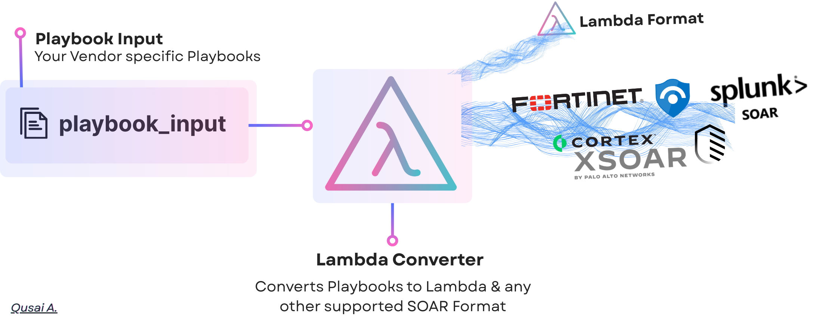

# Lambda-Actions – Generic Standard & Converter for Security Playbooks

  

Lambda-Actions is an open standard to define **portable, platform-agnostic SOAR playbooks** — Lambda-Actions is to Security Actions what [Sigma](https://github.com/SigmaHQ/sigma) is to Detections.

## Why Lambda-Actions Exists
Lambda-Actions aims to eliminate vendor lock-in and fragmentation across automation platforms like:
- SOAR Platforms (e.g. XSOAR, FortiSOAR, Phantom, Resilient)
- Automation Platforms (e.g. Logic Apps, Zapier)
- Custom-built orchestrators

The following diagram shows how Lambda-Actions standardizes playbooks and enables cross-platform SOAR integration:

  

---

## Main Features

### 📖 [`Lambda Schema & Documentation`](./documentations)
- A simple, YAML-based schema that is easy to read, write, and extend. Includes schema references, authoring guides, and best practices.

---

### 🌀 [`LambdaC`](./LambdaC/README.md)
- A powerful convertor tool that converts playbooks to/from different platforms. (Currently Supporting to/from XSOAR, FortiSOAR, Lambda) 

- Utilizes intelligent & validation techniques to convert production-grade playbooks.

---

### 📚 [`Playbooks_Repo`](./Playbooks_Repo)
- A structured repository of converted playbooks, organized by platform:
These playbooks are ready-to-import into supported tools — enabling fast reuse, analysis, or migration.

---

## Contribute to Lambda-Actions

- 🛠️ Improve the spec, the LambdaC converter, or propose features via [Issues](https://github.com/QA-Cyber/Lambda-Actions/issues/new/choose)

---

## Owner

- [Qusai A. (@Qusai A.)](https://github.com/QA-Cyber)
